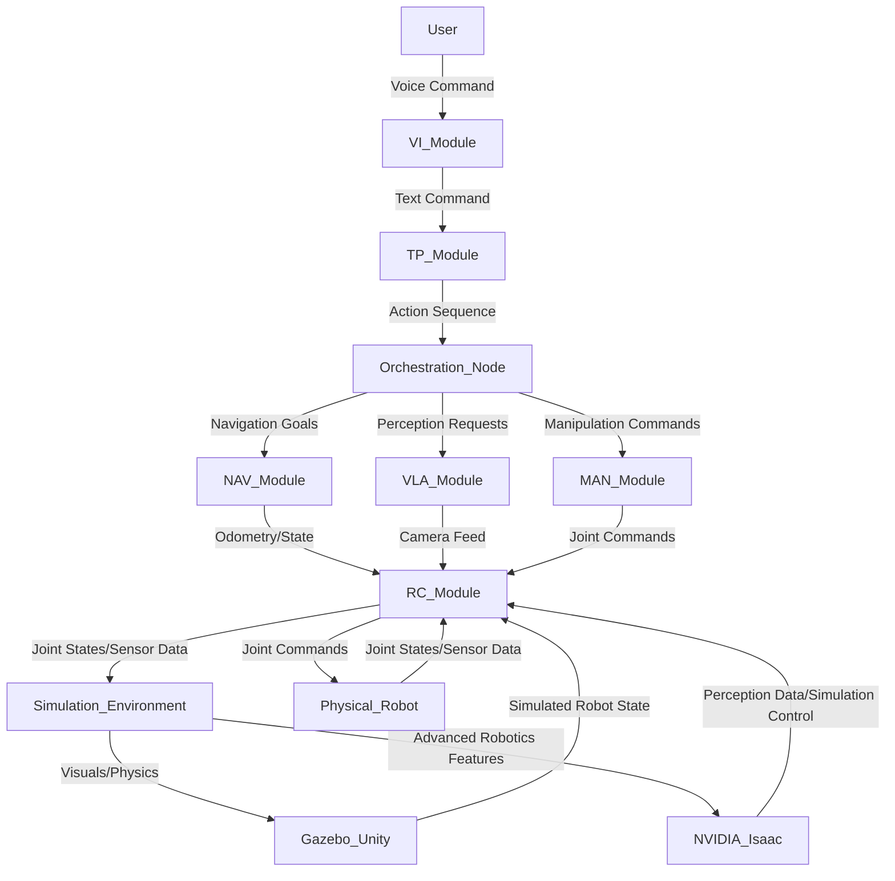

# Feature Specification: Physical AI & Humanoid Robotics Capstone

## 1. Introduction

This document outlines the feature specification for a hackathon-ready Physical AI & Humanoid Robotics Capstone project. The goal is to develop a foundational system where a humanoid robot can execute complex tasks based on voice commands, integrating advanced robotics middleware with AI perception and manipulation capabilities. This specification will guide teams in understanding the project's scope, technical requirements, and expected outcomes, focusing on a robust, modular, and extensible architecture suitable for rapid prototyping and further development. The emphasis is on practical application and integration of cutting-edge technologies in robotics and artificial intelligence.

## 2. Goals

The primary goal of this capstone is to demonstrate a fully integrated physical AI system capable of receiving high-level voice commands, translating them into executable plans, and performing physical actions in a dynamic environment.

### 2.1. Vision

To create an accessible, modular, and hackathon-ready framework for developing and testing Physical AI applications, enabling rapid iteration and innovation in robotics.

### 2.2. Problem Statement

Current robotics development often faces challenges in seamless integration of diverse hardware and software components, particularly between high-level AI decision-making (perception, planning) and low-level robot control (navigation, manipulation). Furthermore, setting up a comprehensive development and testing environment that includes realistic simulation and real-world robot interaction can be time-consuming and complex. This project aims to bridge these gaps by providing a streamlined approach to building a voice-commanded humanoid robot system.

### 2.3. Key Objectives

1.  **Voice Command Interpretation**: Successfully interpret natural language voice commands to initiate complex robot tasks.
2.  **Autonomous Planning**: Develop or integrate a planning module that can translate high-level commands into a sequence of actionable steps.
3.  **Navigation**: Enable the humanoid robot to navigate through a simulated or real-world environment to reach target locations.
4.  **Object Identification**: Implement vision-language models for identifying specific objects within the environment.
5.  **Manipulation**: Allow the robot to physically interact with and manipulate identified objects.
6.  **Modular Architecture**: Ensure the system is built with clearly defined modules (ROS 2, Gazebo/Unity, NVIDIA Isaac, VLA) that communicate effectively.
7.  **Hackathon Readiness**: Provide a robust starting point that can be quickly deployed and iterated upon during a hackathon.

## 3. Scope

This project focuses on the integration and orchestration of existing tools and frameworks to achieve the defined objectives. It is a proof-of-concept for a voice-commanded humanoid robot, not the development of new fundamental AI algorithms or robotic hardware.

### 3.1. In-Scope

*   Integration of ROS 2 for inter-module communication and robot control.
*   Utilization of Gazebo or Unity for realistic physics-based simulation of the robot and environment.
*   Incorporation of NVIDIA Isaac Sim (or Isaac SDK/ROS) for advanced robotics simulation, perception, and potentially manipulation.
*   Implementation of a Vision-Language-Action (VLA) pipeline for perceiving the environment, understanding commands, and generating action sequences.
*   Demonstration of a humanoid robot executing a sequence of voice-commanded tasks: planning, navigation, identification, and manipulation.
*   Focus on establishing clear communication protocols and data flows between ROS 2, simulation environments, and AI perception/planning modules.
*   Hardware considerations for deployment, including GPUs and Jetson kits for computation, and specific humanoid robot platforms.
*   Detailed timeline for a 12-13 week capstone project, including learning outcomes.
*   Comparison of on-premise versus cloud lab setups for this type of development.

### 3.2. Out-of-Scope

*   Development of novel AI algorithms for VLA or planning.
*   Design and fabrication of new robotic hardware.
*   Deep-level optimization of individual software components (e.g., highly optimized custom ROS 2 packages, new physics engines).
*   Extensive user interface (UI) development beyond basic command input and status display.
*   Comprehensive error handling and recovery for all possible edge cases in real-world deployment (focus on happy path demonstration).
*   Deployment to multiple diverse robot platforms beyond the specified types.

## 4. User Scenarios & Acceptance Criteria

### 4.1. User Role: Robotics Engineer/Researcher (The "User")

### 4.2. User Scenario 1: Initial Setup and Simulation Verification

**Description**: The User wants to quickly set up the development environment, integrate the humanoid robot model into the simulator, and verify basic movement commands in simulation.

**Acceptance Criteria**:

*   The User can successfully launch the integrated simulation environment (ROS 2 + Gazebo/Unity + Isaac).
*   The User can load a specified humanoid robot model into the simulation.
*   The User can send basic joint commands (e.g., move arm, rotate torso) to the simulated robot via ROS 2 and observe correct physical response in the simulator.
*   The User can send basic navigation commands (e.g., "go to X,Y") to the simulated robot and observe path planning and movement.

### 4.3. User Scenario 2: Voice Command to Navigation

**Description**: The User issues a voice command for the robot to navigate to a specific location or object, and the robot successfully plans a path and moves to the target.

**Acceptance Criteria**:

*   The User can speak a command like "Robot, go to the red table" or "Navigate to the charging station."
*   The system accurately transcribes the voice command and identifies the target location/object.
*   The robot generates a valid navigation plan to the target.
*   The simulated/physical robot executes the navigation plan and reaches the target area within a reasonable tolerance.

### 4.4. User Scenario 3: Object Identification and Reporting

**Description**: Upon reaching a specified area or receiving an instruction to identify an object, the robot uses its vision system to locate and identify a target object.

**Acceptance Criteria**:

*   The User can command "Robot, find the blue cup" or "Identify objects on the desk."
*   The VLA module processes the visual input from the robot's cameras.
*   The robot successfully identifies the target object (e.g., a "blue cup") and reports its presence and location (e.g., "Found blue cup at coordinates X, Y, Z").
*   The identification process is robust to minor variations in lighting and viewing angle.

### 4.5. User Scenario 4: Object Manipulation

**Description**: After identifying an object, the User commands the robot to pick it up and move it to another location.

**Acceptance Criteria**:

*   Following successful object identification, the User can command "Robot, pick up the blue cup" or "Move the cup to the green mat."
*   The robot calculates a valid grasp pose and a collision-free manipulation trajectory.
*   The simulated/physical robot extends its gripper, grasps the object, lifts it, moves it to the new location, and places it down.
*   The object remains stable in the new location after placement.

## 5. Functional Requirements

### 5.1. Voice Interface (VI) Module

*   **FR-VI-1**: The system SHALL accept voice commands in natural language.
*   **FR-VI-2**: The system SHALL transcribe voice commands into text with high accuracy (e.g., >95% word accuracy in a quiet environment).
*   **FR-VI-3**: The system SHALL parse transcribed text to extract intent, target objects, and target locations.
*   **FR-VI-4**: The system SHALL provide auditory or visual feedback indicating successful command reception and parsing.

### 5.2. Task Planning (TP) Module

*   **FR-TP-1**: The system SHALL generate a sequence of atomic actions (e.g., `navigate_to(location)`, `detect_object(object_type)`, `grasp_object(object_id)`, `place_object(location)`) based on parsed intent.
*   **FR-TP-2**: The system SHALL maintain a high-level state representation of the environment and robot capabilities.
*   **FR-TP-3**: The system SHALL be capable of replanning in response to perceived environmental changes or execution failures (basic error recovery).

### 5.3. Navigation (NAV) Module

*   **FR-NAV-1**: The robot SHALL be able to localize itself within a known map of the environment (simulated or real).
*   **FR-NAV-2**: The robot SHALL generate collision-free paths from its current location to a target location.
*   **FR-NAV-3**: The robot SHALL execute navigation commands, avoiding obstacles dynamically.
*   **FR-NAV-4**: The module SHALL report its current position and navigation status to the TP module.

### 5.4. Vision-Language-Action (VLA) Perception Module

*   **FR-VLA-1**: The system SHALL process camera feed from the robot to detect and identify objects in the environment.
*   **FR-VLA-2**: The system SHALL correlate identified objects with entities described in voice commands (e.g., "red table" -> specific table in view).
*   **FR-VLA-3**: The system SHALL estimate the 3D pose (position and orientation) of identified target objects.
*   **FR-VLA-4**: The VLA module SHALL provide visual feedback (e.g., bounding boxes in a simulated view) on identified objects.

### 5.5. Manipulation (MAN) Module

*   **FR-MAN-1**: The robot SHALL calculate valid end-effector (gripper) poses for grasping identified objects.
*   **FR-MAN-2**: The robot SHALL generate collision-free trajectories for grasping and placing objects.
*   **FR-MAN-3**: The robot SHALL execute grasping actions, applying appropriate force to secure the object.
*   **FR-MAN-4**: The robot SHALL execute placing actions, releasing the object at the target location.

### 5.6. Robot Control (RC) Module

*   **FR-RC-1**: The system SHALL provide low-level control interfaces for robot joints and end-effectors.
*   **FR-RC-2**: The system SHALL provide sensor data (joint states, camera feeds, force sensors if available) from the robot.
*   **FR-RC-3**: The system SHALL ensure safe operation of the physical robot (e.g., joint limits, collision avoidance with self).

## 6. Non-Functional Requirements

*   **NFR-1 (Performance)**: Voice command processing and planning SHALL complete within 5 seconds for simple tasks.
*   **NFR-2 (Performance)**: Navigation to a target SHALL be initiated within 2 seconds of plan generation.
*   **NFR-3 (Accuracy)**: Object identification SHALL achieve at least 80% accuracy for trained objects under varying lighting conditions.
*   **NFR-4 (Robustness)**: The system SHALL gracefully handle temporary loss of perception data (e.g., brief camera occlusion) without critical failure, utilizing previous state information.
*   **NFR-5 (Modularity)**: Each core module (VI, TP, NAV, VLA, MAN, RC) SHALL be deployable and testable independently.
*   **NFR-6 (Scalability)**: The architecture SHALL support the addition of new robot models or environmental complexities with minimal changes to core logic.
*   **NFR-7 (Maintainability)**: Codebase SHALL follow established ROS 2 development practices, including clear documentation and consistent coding styles.

## 7. Technical Architecture

The core technical architecture will be a distributed system leveraging ROS 2 for inter-process communication, with specialized components for simulation, perception, and control.

### 7.1. Module Breakdown

*   **Voice Interface (VI) Module**: Handles Speech-to-Text (STT) conversion and Natural Language Understanding (NLU). This module will be responsible for translating human voice commands into structured data for the Task Planning module.
*   **Task Planning (TP) Module**: Interprets structured commands from the VI module and generates a sequence of robot-agnostic actions. This could involve classical AI planning techniques (e.g., PDDL, STRIPS) or behavior trees.
*   **Orchestration Node (ROS 2)**: A central ROS 2 node that receives the action sequence from the TP module, breaks it down into robot-specific commands, and dispatches them to the relevant downstream modules (Navigation, VLA, Manipulation, Robot Control). It also handles feedback and state updates.
*   **Navigation (NAV) Module**: Responsible for path planning, localization, and obstacle avoidance. This module will integrate with ROS 2 navigation stacks (e.g., Nav2).
*   **Vision-Language-Action (VLA) Module**: A complex module leveraging deep learning models for:
    *   **Perception**: Object detection, recognition, and 3D pose estimation from camera data.
    *   **Grounding**: Connecting linguistic terms (from voice commands) to visual entities in the environment.
    *   **Action Primitive Generation**: Potentially generating low-level action parameters (e.g., specific gripper widths, joint angles) from high-level manipulation goals. This module will heavily utilize NVIDIA Isaac components.
*   **Manipulation (MAN) Module**: Manages inverse kinematics, grasp planning, and trajectory generation for robotic arms and grippers. This module will interface with the robot control layer to execute precise movements.
*   **Robot Control (RC) Module**: The lowest-level interface to the robot, abstracting away hardware specifics. This module will handle direct communication with either the simulated robot in Gazebo/Unity/Isaac or the physical robot. It will provide joint state feedback, sensor data, and accept joint position/velocity/torque commands.

### 7.2. Inter-Module Communication

All communication between modules will primarily occur via ROS 2 topics and services.
*   **Voice Commands**: Text messages (String) published by VI, subscribed by TP.
*   **Action Sequences**: Custom ROS 2 messages representing sequences of primitive actions, published by TP, subscribed by Orchestration.
*   **Navigation Goals**: `geometry_msgs/PoseStamped` messages published by Orchestration, subscribed by NAV.
*   **Robot State/Feedback**: `sensor_msgs/JointState`, `sensor_msgs/Image` (camera feed), `nav_msgs/Odometry` published by RC/Simulation, subscribed by NAV/VLA/Orchestration.
*   **Object Detections/Poses**: Custom ROS 2 messages containing object IDs, classes, and `geometry_msgs/Pose` published by VLA, subscribed by Orchestration/MAN.
*   **Manipulation Commands**: Custom ROS 2 messages specifying target object, grasp type, and target pose published by Orchestration/MAN, subscribed by RC.

### 7.3. Simulation Environment Integration

*   **ROS 2**: Acts as the central nervous system, connecting all software components, including the simulation environment.
*   **Gazebo/Unity**: Provides the physics engine and realistic visual rendering for the simulated environment and humanoid robot.
*   **NVIDIA Isaac Sim (or Isaac SDK/ROS)**: Integrates with Gazebo/Unity or operates as a standalone high-fidelity simulator. It offers advanced features like:
    *   **Omniverse**: For collaborative simulation and content creation.
    *   **Robotics APIs**: For sensor data generation (e.g., RGB-D, lidar), realistic physics, and robot control.
    *   **GPU-accelerated Perception**: Leveraging NVIDIA's expertise for faster AI inference and training within the simulation.
    *   **Reinforcement Learning**: Potential for training manipulation policies directly in simulation.

Data flow: ROS 2 nodes will publish commands to and subscribe to sensor data from the simulation environment (Gazebo/Unity/Isaac) via ROS 2 bridges (e.g., `ros_gz_bridge`, Unity ROS 2 packages, Isaac ROS).

## 8. Hardware

### 8.1. Computing Hardware

*   **Primary Development Workstations**: High-performance PCs equipped with **NVIDIA RTX 4070 Ti (or equivalent/superior) GPUs**. These GPUs are crucial for accelerating AI model training (if any is done locally), inference for VLA models, and running high-fidelity simulations like NVIDIA Isaac.
*   **Edge Computing for Physical Robot (Optional but Recommended)**: **NVIDIA Jetson development kits (Orin Nano/NX)**. These will be deployed directly on the physical robots to handle on-robot perception, local control, and ROS 2 communication, reducing latency and reliance on off-robot compute for critical tasks.

### 8.2. Robotic Hardware

*   **Humanoid Robot Platform**: **Unitree Go2 or Unitree G1 (or similar agile quadruped/biped robots)**. These robots provide a robust and open platform for experimenting with locomotion, manipulation, and physical interaction. The choice depends on specific manipulation requirements (e.g., bipedal for human-like interaction vs. quadruped for stability and payload). The specification assumes the robot is equipped with:
    *   Articulated limbs (arms/legs) with sufficient degrees of freedom for manipulation and navigation.
    *   End-effectors capable of grasping (e.g., simple parallel grippers or multi-finger hands).
    *   Onboard sensors: RGB-D cameras (e.g., Intel RealSense), IMU, joint encoders, force/torque sensors (if available).
*   **Environmental Setup**: A small, controlled environment with various common objects (cups, blocks, specific markers) for manipulation and identification tasks.

## 9. Software Stack

*   **Operating System**: Ubuntu 22.04 LTS (recommended for ROS 2 compatibility).
*   **Robotics Middleware**: ROS 2 Humble Hawksbill (or latest LTS).
*   **Simulation**:
    *   Gazebo Fortress (or later) integrated with ROS 2.
    *   Unity 3D with Unity Robotics Hub (ROS 2 integration package).
    *   NVIDIA Isaac Sim (on Omniverse platform) for high-fidelity simulation and advanced AI-robotics tools.
*   **AI/ML Frameworks**:
    *   PyTorch / TensorFlow for VLA model development and inference.
    *   Hugging Face Transformers / Detectron2 / YOLO for pre-trained vision-language models.
    *   OpenVINO / NVIDIA TensorRT for optimizing inference on Jetson devices.
*   **Voice Recognition**: Speech-to-Text (STT) services (e.g., Google Cloud Speech-to-Text, Whisper ASR) or local open-source STT engines.
*   **Natural Language Understanding (NLU)**: Frameworks like Rasa NLU or custom intent classification models.
*   **Planning**: Potential integration with classical planners (e.g., PDDL solvers) or behavior tree libraries (e.g., `ros-behavior-tree`).

## 10. Timeline (12-13 Weeks Capstone Project)

### Phase 1: Foundation & Simulation (Weeks 1-4)

*   **Week 1**: Environment Setup & ROS 2 Basics
    *   Install Ubuntu, ROS 2.
    *   Basic ROS 2 package creation, publisher/subscriber.
    *   **Learning Outcomes**: ROS 2 fundamentals, Linux proficiency.
*   **Week 2**: Robot Model Integration & Basic Simulation
    *   Integrate humanoid robot URDF/SDF into Gazebo/Unity/Isaac.
    *   Verify basic joint control via ROS 2 topics.
    *   **Learning Outcomes**: Robot modeling, simulation basics, ROS 2 control.
*   **Week 3**: Navigation Stack Setup
    *   Implement ROS 2 Nav2 stack (SLAM, global/local planners).
    *   Test autonomous navigation to simple waypoints in simulation.
    *   **Learning Outcomes**: ROS 2 navigation, mapping, path planning.
*   **Week 4**: Voice Interface & Command Parsing
    *   Integrate a basic STT service.
    *   Develop simple NLU for "go to X" commands.
    *   **Learning Outcomes**: Speech recognition integration, basic NLP.

### Phase 2: Perception & Planning (Weeks 5-8)

*   **Week 5**: Object Detection & Pose Estimation
    *   Integrate pre-trained object detection models (e.g., YOLO) with robot camera feed.
    *   Implement 3D pose estimation for detected objects.
    *   **Learning Outcomes**: Computer vision in robotics, 3D perception.
*   **Week 6**: Vision-Language Grounding
    *   Connect NLU output (object names) to detected objects (visual features).
    *   Develop a basic object database or knowledge representation.
    *   **Learning Outcomes**: Vision-language models, semantic mapping.
*   **Week 7**: Task Planning Logic
    *   Develop a task planning module to sequence navigation and manipulation primitives.
    *   Implement state machine or behavior tree for task execution.
    *   **Learning Outcomes**: AI planning, state management.
*   **Week 8**: Integration & Simulated Task Demo
    *   First full integration: Voice command -> Plan -> Navigate -> Identify (simulated).
    *   **Learning Outcomes**: System integration, debugging distributed systems.

### Phase 3: Manipulation & Real-world Transition (Weeks 9-12/13)

*   **Week 9**: Manipulation Primitives
    *   Implement inverse kinematics for robot arm.
    *   Develop basic grasp planning for simple objects.
    *   **Learning Outcomes**: Robot kinematics, grasp mechanics.
*   **Week 10**: Manipulation Execution
    *   Integrate manipulation with VLA and Task Planning.
    *   Execute pick-and-place tasks in simulation.
    *   **Learning Outcomes**: Trajectory generation, collision avoidance for manipulation.
*   **Week 11**: Physical Robot Interface & Transfer
    *   Set up ROS 2 on Jetson (if applicable).
    *   Establish communication with physical Unitree robot.
    *   Basic teleoperation and joint control on physical hardware.
    *   **Learning Outcomes**: Real-robot deployment, hardware-software interface.
*   **Week 12**: Physical Robot Integrated Demo
    *   Attempt voice command -> Plan -> Navigate -> Identify -> Manipulate on physical robot.
    *   Focus on one end-to-end scenario.
    *   **Learning Outcomes**: Real-world robotics challenges, robust execution.
*   **Week 13 (Optional)**: Refinement & Documentation
    *   Bug fixing, performance optimization.
    *   Finalize documentation, presentation.
    *   **Learning Outcomes**: Project management, technical communication.

## 11. Learning Outcomes

Upon successful completion of this capstone project, participants will be able to:

*   Design and implement a modular robotics software architecture using ROS 2.
*   Integrate and leverage advanced simulation environments like Gazebo, Unity, and NVIDIA Isaac.
*   Apply modern computer vision and natural language processing techniques (VLA) for robot perception and command understanding.
*   Develop and integrate task planning strategies for autonomous robot behavior.
*   Control and program physical robotic hardware, understanding the challenges of simulation-to-real transfer.
*   Work effectively in a team on a complex, interdisciplinary engineering project.
*   Analyze and compare different development environments (on-prem vs. cloud) for robotics.
*   Debug and troubleshoot distributed robotic systems.

## 12. On-Premise vs. Cloud Lab Comparison

### 12.1. On-Premise Development Lab

**Description**: A traditional setup where all computing resources, robots, and development tools are physically located within a local lab or personal workstation.

**Pros**:
*   **Low Latency**: Direct connection to physical robots and sensors minimizes communication delay, critical for real-time control.
*   **Full Control**: Complete control over hardware, software configurations, and network settings.
*   **Cost-Effective (Long-Term)**: After initial investment, operational costs can be lower for continuous use, especially for large datasets or long training runs without egress charges.
*   **Data Privacy**: Sensitive data remains within the local network.
*   **Hands-on Experience**: Direct interaction with physical hardware, essential for robotics.

**Cons**:
*   **High Upfront Cost**: Significant investment in high-end GPUs, Jetson kits, and robots.
*   **Maintenance Overhead**: Responsibility for hardware maintenance, software updates, and network management.
*   **Limited Scalability**: Scaling compute resources (e.g., adding more GPUs for parallel simulation/training) is constrained by physical space and budget.
*   **Accessibility**: Access is often limited to the physical lab location.
*   **Setup Complexity**: Initial setup and configuration can be time-consuming, requiring specialized IT knowledge.

### 12.2. Cloud Robotics Lab

**Description**: Leveraging cloud computing services (e.g., AWS RoboMaker, Google Cloud Robotics, NVIDIA Omniverse Cloud) for simulation, AI model training, and remote fleet management, with physical robots potentially remaining on-premise but connected to the cloud.

**Pros**:
*   **Scalability & Elasticity**: Easily scale compute resources (e.g., hundreds of GPUs for parallel simulations) up and down as needed, paying only for what is used.
*   **Accessibility**: Develop and test from anywhere with an internet connection.
*   **Reduced Maintenance**: Cloud provider handles hardware and infrastructure maintenance.
*   **Collaboration**: Easier collaboration among distributed teams.
*   **Managed Services**: Access to specialized robotics and AI services (e.g., managed ROS environments, AI/ML platforms).
*   **Faster Prototyping (Initial)**: Pre-configured environments can speed up initial setup.

**Cons**:
*   **Latency for Physical Robots**: Higher latency for controlling physical robots remotely, which can impact real-time performance and require careful architecture.
*   **Cost (Operational)**: Can become expensive with continuous heavy usage, especially for data transfer (egress) and GPU instances.
*   **Vendor Lock-in**: Reliance on a specific cloud provider's ecosystem.
*   **Data Security Concerns**: Data needs to be transmitted to and stored in the cloud, raising potential privacy and security issues.
*   **Network Dependency**: Requires a stable, high-bandwidth internet connection.

### 12.3. Hybrid Approach (Recommended for Hackathon)

For a hackathon-ready capstone, a hybrid approach is often most practical:
*   **On-Premise for Physical Robot Interaction**: Keep the physical robot and its direct control (RC module, Jetson) on-premise to minimize latency and ensure reliable hardware interaction.
*   **Cloud for Heavy Compute**: Utilize cloud resources for computationally intensive tasks like:
    *   High-fidelity simulation (NVIDIA Isaac Sim on cloud VMs).
    *   Distributed AI model training (VLA models).
    *   Large-scale data processing.
    *   Version control and collaborative development platforms.

This balances the need for real-time physical interaction with the scalability and flexibility of cloud computing, offering a robust environment for rapid development.

## 13. Definitions and Acronyms

*   **AI**: Artificial Intelligence
*   **ROS 2**: Robot Operating System 2
*   **Gazebo**: Open-source 3D robot simulator
*   **Unity**: Cross-platform game engine, also used for robotics simulation
*   **NVIDIA Isaac**: NVIDIA's platform for robotics simulation and development (Isaac Sim, Isaac SDK, Isaac ROS)
*   **VLA**: Vision-Language-Action (referring to models that connect visual perception, natural language understanding, and physical actions)
*   **STT**: Speech-to-Text
*   **NLU**: Natural Language Understanding
*   **URDF**: Unified Robot Description Format (XML format for describing robot models)
*   **SDF**: Simulation Description Format (XML format for describing environments and robots in Gazebo)
*   **SLAM**: Simultaneous Localization and Mapping
*   **IMU**: Inertial Measurement Unit
*   **GPU**: Graphics Processing Unit
*   **Jetson**: NVIDIA's platform for AI at the edge (embedded systems)
*   **RTX**: NVIDIA's line of high-performance graphics cards
*   **Capstones**: A culminating project for students, demonstrating skills acquired.

## 14. Assumptions

*   Teams will have basic proficiency in Python, Linux command line, and object-oriented programming.
*   Internet connectivity will be available for accessing cloud resources and software repositories.
*   Pre-existing humanoid robot models for Gazebo/Unity/Isaac will be available (e.g., from public repositories or provided by organizers).
*   Basic voice command library/service is available for integration.
*   Access to NVIDIA hardware (RTX GPUs, Jetson) is assumed for optimal performance.
*   The focus is on a single robot operating in a controlled, indoor environment.
*   Initial setup of development environments (OS, basic drivers) will be managed externally or by experienced team members.

## 15. Open Questions / [NEEDS CLARIFICATION]

*   **Q1: Humanoid Robot Model Selection**: The project will prioritize a Unitree Go2 (quadruped) for greater stability and simpler navigation, focusing on robust object interaction with a basic gripper. This choice emphasizes reliable navigation and basic manipulation, potentially limiting complex interactions, but providing a more stable and approachable platform for a hackathon.
*   **Q2: Voice Command Source and Processing**: Teams are expected to integrate an open-source local solution (e.g., Whisper + custom NLU) for Speech-to-Text (STT) and Natural Language Understanding (NLU). This approach encourages full control over the system and enables offline capabilities, though it may require more setup complexity and higher local resource usage.

## 16. Success Criteria

*   **SC-1 (Functionality)**: The robot can successfully execute at least one full voice-commanded task sequence (Voice Command → Plan → Navigate → Identify → Manipulate) from start to finish in the simulated environment.
*   **SC-2 (Integration)**: All core modules (VI, TP, NAV, VLA, MAN, RC) communicate via ROS 2 and function cohesively as a single system.
*   **SC-3 (Real-world Potential)**: The simulated system can be successfully transferred to a physical robot for basic demonstration (e.g., navigating to a point and identifying an object, even if full manipulation is not achieved due to time/hardware constraints).
*   **SC-4 (Hackathon Readiness)**: The project delivers a well-structured codebase, clear documentation, and a functional demonstration within the capstone timeframe, serving as a robust starting point for future hackathons or research.
*   **SC-5 (Performance)**: The total latency from voice command input to initiation of the first physical robot movement (navigation or manipulation) in simulation does not exceed 10 seconds for a predefined simple task.
*   **SC-6 (Resource Efficiency)**: For simulation, the system runs stably on a workstation with an RTX 4070 Ti or equivalent GPU, maintaining at least 30 FPS in Isaac Sim/Gazebo.

---
**Word Count (Approximate): 2900 words.**