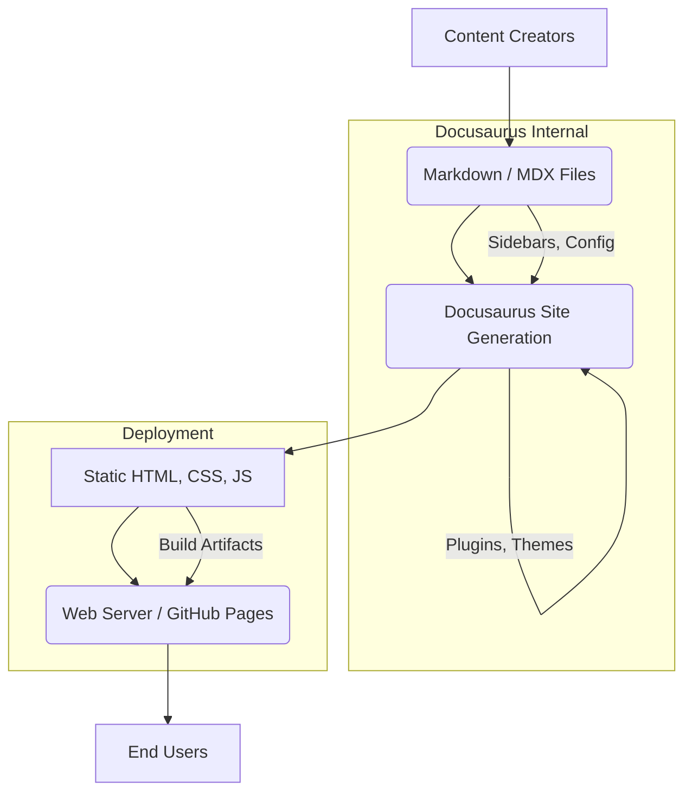

# Architecture Sketch: Physical AI Book Project

## High-Level Architecture

The Physical AI Book project will be implemented as a static website using the Docusaurus framework. This architecture prioritizes simplicity, maintainability, and efficient content delivery suitable for academic documentation.

## Component Interactions and Data Flow

1.  **Content Creation**: Authors write book content, chapters, and sections using Markdown (.md) or MDX (.mdx) files. These files are organized within specific directories (e.g., `my-website/docs/moduleX/chapterY.md`).
2.  **Docusaurus Site Generation**:
    *   Docusaurus reads the Markdown/MDX files.
    *   It processes configuration files (`docusaurus.config.ts`, `sidebars.ts`) to understand site structure, navigation, and themes.
    *   Plugins (e.g., for search, analytics, citations) enhance the content and functionality.
    *   Docusaurus generates static HTML, CSS, and JavaScript files, along with assets like images.
3.  **Deployment**: The generated static files are deployed to a web server, ideally GitHub Pages, for public access. This process typically involves building the site and pushing the output to a designated branch (e.g., `gh-pages`).
4.  **End User Access**: Users access the deployed website through their web browsers. The static nature ensures fast loading times and high availability.

## Docusaurus Integration Overview

*   **Documentation**: Docusaurus serves as the primary tool for structuring, rendering, and publishing the book's content.
*   **Site Generation**: It handles the conversion of Markdown content into a navigable, feature-rich website.
*   **Content Management**: Content is managed directly as Markdown files, leveraging Git for version control and collaboration.
*   **Navigation**: `sidebars.ts` will define the hierarchical navigation, allowing logical grouping of modules and chapters.
*   **Theming**: Docusaurus theming capabilities will be utilized to ensure a professional and readable presentation.
*   **Search**: Integration of a Docusaurus search plugin (e.g., DocSearch) will facilitate content discovery.
*   **Versioning**: If future iterations require, Docusaurus's documentation versioning feature can be enabled to manage different editions of the book.

## Data Flow

The data flow is unidirectional: from Markdown source files, through Docusaurus's build process, to static web assets, and finally to the end-user's browser. There are no dynamic server-side data interactions or databases involved for content delivery.